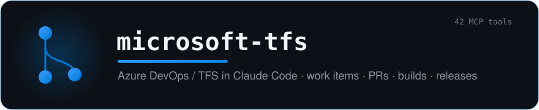

<div align="center">



### Full Azure DevOps / TFS, without leaving Claude Code.

A Node/TypeScript **MCP server** (stdio) that bridges Claude Code straight into on-premise Microsoft TFS — **work items, pull requests, builds, releases, repos and branches** — across **42 tools**. A port of the original .NET TFS plugin.

[](./.claude-plugin/plugin.json)
[](https://docs.claude.com/en/docs/claude-code)
[](https://nodejs.org)
[](#-tools-42)
[](./LICENSE)

```sh
/plugin marketplace add yoannyviquel/marketplace
/plugin install microsoft-tfs
```

</div>

---

> Stop tabbing out to the web portal. Create a work item, open a PR, vote, queue a build, deploy a release — all from the prompt, with **Markdown-formatted output** (icons, timestamps, diffs) made to read well inside Claude.

## ✨ Features

| Domain | What you can do |
|---|---|
| 📋 **Work items** | Create, search (WIQL/JQL-style), read, update, comment, delete Bugs / Tasks / Stories / Features. |
| 🔀 **Pull requests** | Create, update, vote, complete, abandon, auto-complete, draft/publish, threaded comments, diffs, iterations. |
| 🏗️ **Builds** | List, queue, cancel builds; fetch build definitions. |
| 🚀 **Releases** | Create, deploy, approve, abandon, rename; list definitions, releases and deployments. |
| 📦 **Repos & branches** | List/search repositories; bulk-clean stale branches. |
| 🔌 **Connection** | `testconnection` + `/microsoft-tfs:doctor` to verify the server and your PAT in one shot. |

## 🔀 In action

```text
> tfs_getpullrequest(project="Offres", id=418443)

#418443 · Ceph → PureStorage migration  ✅ active
  feature/pure-migration → master · 👤 yoann.yviquel
  ✔ 2 approvals · 💬 3 threads (1 unresolved) · 🔧 build: succeeded
```

<!-- TODO: replace the block above with a real screenshot/GIF of a tfs_* tool answer in Claude -->
<!-- <p align="center"></p> -->

## 🚀 Install

```text
/plugin marketplace add yoannyviquel/marketplace
/plugin install microsoft-tfs
```

On install, Claude Code **prompts you directly** (via the plugin's `userConfig`) for the connection — no `settings.json` editing:

| Prompt | Env | Required | Default |
|---|---|---|---|
| **TFS Personal Access Token** | `TFS_TOKEN` | ✅ (stored securely) | — |
| **TFS Base URL** | `TFS_BASE_URL` | optional | `http://tfs.example.com:8080/tfs` |
| **TFS Collection / Organization** | `TFS_ORG` | optional | `DefaultCollection` |

Create the PAT from your TFS user settings: `{baseUrl}/{DefaultCollection|Company}/_usersSettings/tokens`. Authentication is **by PAT only**.

Then **restart Claude Code** (`/exit` and relaunch) — the MCP stdio process is spawned at startup, so `/reload-plugins` alone does not restart it. Finally verify:

```text
/microsoft-tfs:doctor
```

> **Reconfigure later:** `/plugin` → microsoft-tfs → reconfigure.
> **Updates:** `/plugin` detects the new version → `/reload-plugins` → `/exit` and relaunch.

## 🧩 Tools (42)

All names are prefixed with `tfs_` (e.g. `tfs_testconnection`).

<details>
<summary><b>Browse the full tool list, by category</b></summary>

**Connection (1)** — `testconnection`

**Projects (3)** — `getprojects`, `searchprojects`, `getproject`

**Work items (6)** — `createworkitem`, `addcomment`, `searchworkitems`, `getworkitem`, `updateworkitem`, `deleteworkitem`

**Repositories (2)** — `getrepositories`, `searchrepositories`

**Builds (4)** — `getbuilds`, `queuebuild`, `cancelbuild`, `getbuilddefinitions`

**Releases (10)** — `getreleasedefinitions`, `getreleasedefinition`, `getreleases`, `getdeployments`, `deployrelease`, `getreleaseapprovals`, `approverelease`, `abandonrelease`, `createrelease`, `renamerelease`

**Pull Requests (15)** — `getpullrequests`, `getpullrequest`, `createpullrequest`, `updatepullrequest`, `abandonpullrequest`, `voteonpullrequest`, `completepullrequest`, `setautocompletepullrequest`, `markpullrequestdraft`, `publishpullrequest`, `getpullrequestcomments`, `addpullrequestcomment`, `resolvepullrequestcomment`, `getpullrequestdiff`, `getpullrequestiterations`

**Branches (1)** — `cleanbranches`

</details>

## 🛠️ Development

```bash
npm install
npm run build         # produces dist/server.js (ESM bundle, shebang)
npm run dev           # runs the server over stdio via tsx
npm test              # offline E2E tests (fetch is mocked — deterministic, no TFS_TOKEN, no network)
npm run smoke         # E2E smoke test against the real TFS (requires TFS_TOKEN)
npm run typecheck     # typecheck the source (src/)
npm run typecheck:test # typecheck source + tests (test/)
```

<details>
<summary><b>E2E tests & architecture</b></summary>

### E2E tests (offline)

Tests under `test/` exercise the real path `args → handler → TfsClient → fetch → markdown`, replacing only `globalThis.fetch` with a route-driven fake (`test/helpers/fetch-mock.ts`). No network, no PAT: they run anywhere and in CI. Each tool has at least a happy-path case (plus an assertion on the URL/method called), an error case, and argument validation where relevant. `test/registry.test.ts` locks down the set of 42 exposed tools. To add a tool, update `EXPECTED_TOOLS` (a deliberate API change) and add its file to the `test` script in `package.json`.

### Architecture

See `src/server.ts` for the MCP bootstrap. Tools are registered via a flat `ToolDefinition[]` list aggregated in `src/tools/index.ts`.

</details>

---

<div align="center">

MIT © Yoann Yviquel · Part of the [**yoannyviquel** marketplace](https://github.com/yoannyviquel/marketplace)

</div>
